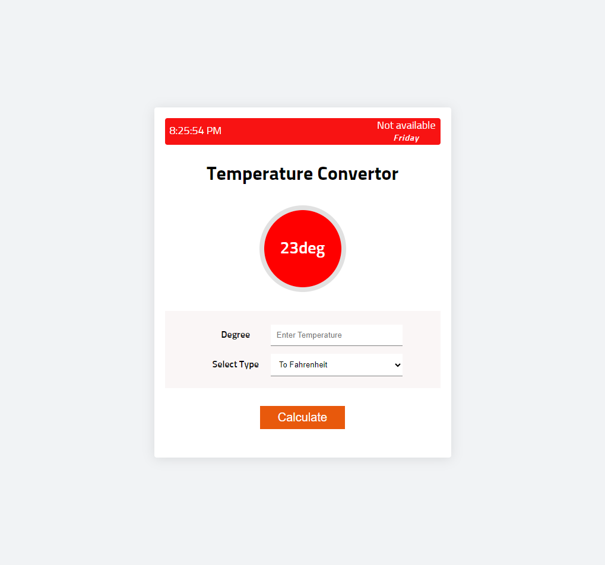

#Temperature Calculator

This is the basic website for calculating the temperature. It will convert it from celsius to Fahrenheit and other way around.

Result will be shown in the center with the nice circle.

Also shows the current time and date.

Built using html, css and javascript.




```Javascript
// Formula used to calculate from celsius to fahrenheit

function celsiusToFah(celsius) {
    return (celsius * 9) / 5 + 32;
}

// Formula used to calculate from Fahrenheit to celsius
function fahrenheitToCel(fahrenheit) {
  return ((fahrenheit - 32) * 5) / 9;
}
```
